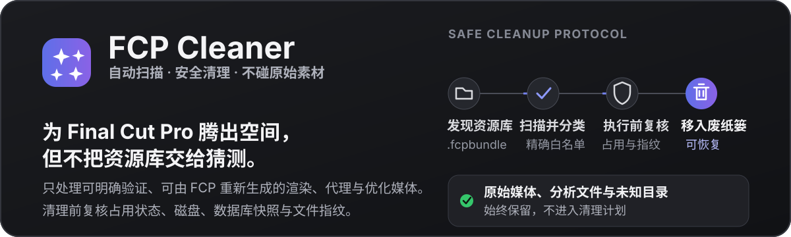
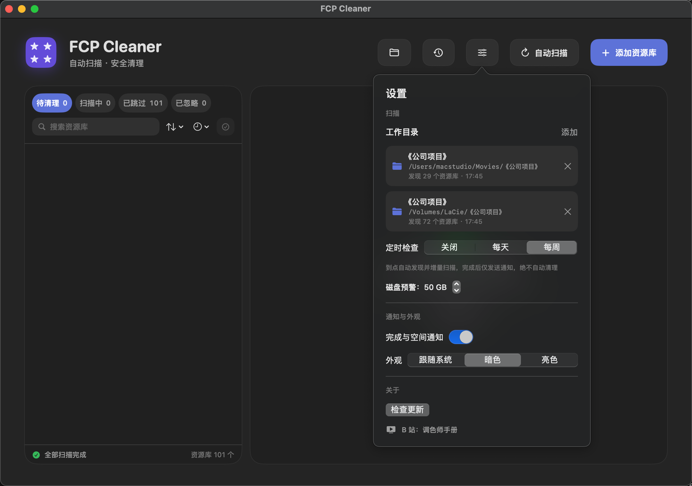

<p align="center">
  
</p>

<p align="center">
  <a href="https://github.com/zhouxuan3550/fcp-cleaner/releases/latest"><strong>下载最新版本</strong></a>
  &nbsp;·&nbsp;
  <a href="#安全边界">了解安全机制</a>
  &nbsp;·&nbsp;
  <a href="#本地开发">本地开发</a>
</p>

FCP Cleaner 是一款原生 macOS 应用，用于扫描 Final Cut Pro 的 `.fcpbundle` 资源库，并将经过验证的渲染文件、代理媒体和优化媒体移入废纸篓。它不会把“看起来像缓存”的目录当作可清理对象。

## 界面

<p align="center">
  
</p>

设置工作目录后，FCP Cleaner 会发现其中的资源库；也可手动添加资源库或通过 Final Cut Pro Workflow Extension 打开当前资源库。自动扫描只负责发现与分析，绝不会自动清理。

## 能做什么

- 自动扫描工作目录与本机可用卷中的 FCP 资源库，支持外置磁盘重新挂载后的增量扫描。
- 仅识别已验证的渲染文件、代理媒体和优化媒体；支持外置缓存位置。
- 支持多选批量清理、最小体积门槛、低磁盘空间提醒、定时检查和清理历史。
- 清理项目移入 macOS 废纸篓，不直接永久删除；历史记录可用于定位和恢复。
- 可从 Final Cut Pro Workflow Extension 将当前资源库交给 FCP Cleaner，但所有清理仍回到主程序完成完整预检。

## 安全边界

清理只会发生在 `FCPStructureRules` 定义的精确白名单中。原始媒体、分析文件、资源库数据库、未知目录和符号链接目标始终受保护。

执行前会再次验证：

- Final Cut Pro 未在使用目标资源库。
- 磁盘仍在线且资源库可写。
- 资源库数据库快照、候选目录和文件指纹自扫描后没有变化。

任一条件不满足时，清理会停止而不是猜测。即使通过验证，涉及重要项目时仍建议先关闭使用该资源库的 Final Cut Pro。

## 安装

1. 从 [Releases](https://github.com/zhouxuan3550/fcp-cleaner/releases) 下载 universal DMG（Apple Silicon 与 Intel 均可用）。
2. 打开 DMG，将 `FCP Cleaner.app` 拖到 `Applications`。
3. 首次使用时添加一个资源库，或在设置中添加工作目录后开始扫描。

要求：macOS 15.0 或更高版本。使用 Workflow Extension 还需要 Final Cut Pro 12.3 或更高版本。

> 当前发布包使用 ad-hoc 签名，尚未进行 Apple Developer ID 签名或公证。macOS 如阻止首次打开，请在“系统设置 → 隐私与安全性”中确认打开。

## 本地开发

开发 Workflow Extension 前，请从 Apple 下载并安装 [Workflow Extension SDK](https://developer.apple.com/download/all/?q=WorkflowExtensions)。

```bash
swift test
xcodegen generate --spec project.yml
xcodebuild -project FCPLibraryCleaner.xcodeproj -scheme FCP-Cleaner build
```

生成 universal2 安装包：

```bash
./release.sh <版本号> <构建号>
```

## 许可证

本项目为**源码可见（Source Available）**，不是 OSI 定义的开源软件。除 GitHub 公开仓库服务条款及适用法律不可排除的权利外，未经版权所有者事先明确书面授权，不得编译、运行、使用、复制、修改、分发、商用或创建衍生作品。

申请授权请通过本仓库联系版权所有者。完整条款见 [FCP Cleaner Source Code License 1.0](LICENSE)。该协议自 `4.0.0` 起适用；此前已按 MIT 发布的版本仍遵循各自随附的原协议，已经授予的旧版本许可不会被本协议追溯撤销。
